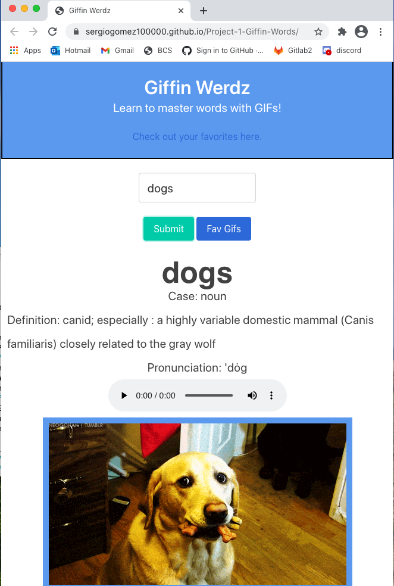

# Project Title: 
Giffin Werdz


# Project Description: 
For those who want to study better or have a better understanding of words and definitons, this app is a fun way to increase vocabulary and understand definitions with the help of gifs.

#Links
Link to the deployed app: https://sergiogomez100000.github.io/Giffin-Wordz/
Link to the Github: https://github.com/sergiogomez100000/Giffin-Wordz

# User story:

```md 
AS A student
I WANT to increase my vocabulary
SO THAT I can improve my understanding of words and have fun
```
# Wireframe sketch:


# APIs: 
https://dictionaryapi.com/products/api-collegiate-dictionary

http://api.giphy.com/v1/gifs/search

# Rough breakdown of tasks:
```md
Create Title box/Hero
Create containers to style info
Create search box with submit button
Access merman-wester info with api key
Access giphy with api key
Populate info from api into appropriate areas
Add favorite button and created storage
Add second page for favorite gifs
Display gifs on second page
Used Bulma and own CSS to style both pages
Team collaboration on all code and project processes
```
